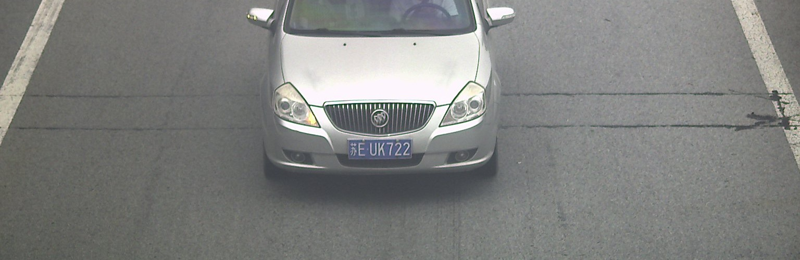
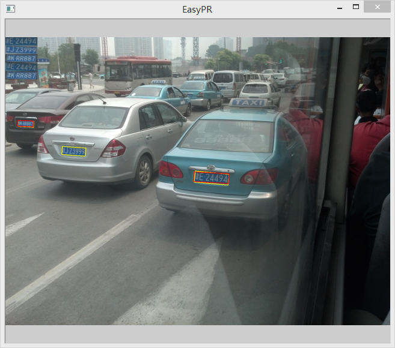
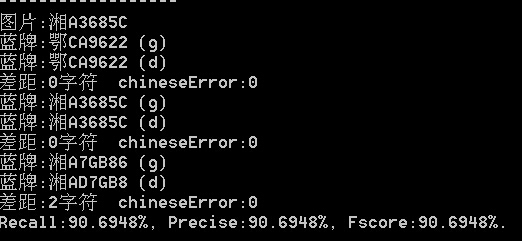

forked from https://gitee.com/easypr/EasyPR

# EasyPR

EasyPR is an open source Chinese license plate recognition system whose goal is to become a simple, efficient and accurate license plate recognition library under unconstrained situation.

Compared to other license plate recognition systems, EasyPR has the following characteristics:

* It is based on the openCV open source library. This means you can get the full source code and port it to all platforms supported by opencv.
* It recognizes Chinese. For example, the license plate is a picture of Su EUK722, which can accurately output the result of "Sue EUK722" of std:string type.
* Its recognition rate is high. With clear pictures, license plate detection and character recognition can achieve an accuracy of more than 80%.

### Update

This update is the official version of 1.6, with the following updates:

1. Fixed text prompts for multiple readme.

2. Added a link to a project called C#EasyPR, thanks to @zhang-can.


**note**

1. For Opencv 3.2 or above, if you encounter compilation problems, such as "ANN_MLP" related errors, try changing #define CV_VERSION_THREE_ZERO to #define CV_VERSION_THREE_TWO in config.h.

2. Linux system recommends using Opencv3.2 or higher. 3.2 The following versions, such as 3.0 and 3.1, may appear to be empty when the license plate recognition result is empty. For the sake of stability, it is recommended to upgrade to the latest 3.2 version. The Windows version does not have this problem.

## Work to be done
- [ ] Complete a CNN framework
- [ ] Replace ANN with CNN
- [ ] Increase the identification of new energy vehicles (to be determined)
- [ ] Increase the identification of two lanes of license plates (to be determined)

### Cross-platform

In addition to the Windows platform, there are also EasyPR versions of the following other platforms. Some versions of the platform may temporarily lag behind the main platform.

There is now a [lazy version] of the 1.5 version of opencv (http://git.oschina.net/easypr/EasyPR/attach_files). Only support vs2013, can only run under debug and x86, in other cases you still have to configure opencv. Thanks to the help of Fan Wenjie. Both files on the page should be downloaded and downloaded using [7zip] (http://www.7-zip.org/).

|Version | Developer | Version | Address
|------|-------|-------|-------
C# | zhang-can | 1.5 | [zhang-can/EasyPR-DLL-CSharp](https://github.com/zhang-can/EasyPR-DLL-CSharp)
| android | goldriver | 1.4 | [linuxxx/EasyPR_Android](https://github.com/linuxxx/EasyPR_Android)
| linux | Micooz | 1.6 | Integrated with EasyPR
| ios | zhoushiwei | 1.3 | [zhoushiwei/EasyPR-iOS](https://github.com/zhoushiwei/EasyPR-iOS)
| mac | zhoushiwei,Micooz | 1.6 | Integrated with EasyPR
| java | fan-wenjie | 1.2 | [fan-wenjie/EasyPR-Java](https://github.com/fan-wenjie/EasyPR-Java)
| lazy version | fan-wenjie | 1.5 | [git/oschina](http://git.oschina.net/easypr/EasyPR/attach_files)

### Compatibility

The current EasyPR is based on the opencv3.0 version. Versions 3.0 and above should be compatible. Previous versions may be incompatible.

### Examples

Suppose we have the original image below, we need to identify the middle license plate characters and colors:



After the first step of EasyPR's PlateDetect, we obtained the tiles containing only the license plates in the original image:


Next, we perform the OCR process on the tile. In EasyPR, it is called CharsRecognize. We got a string containing the license plate color and characters:

"Blue: Su EUK722"

###example

The call to EasyPR is very simple. Here is a sample code:
```c++
CPlateRecognize pr;
pr.setResultShow(false);
pr.setDetectType(PR_DETECT_CMSER);
     
Vector<CPlate> plateVec;
Mat src = imread(filepath);
Int result = pr.plateRecognize(src, plateVec);
```

We first create a CPlateRecognize object pr, and then set the properties of pr.

```c++
pr.setResultShow(false);
```

This sentence sets whether EasyPR opens the result display window, as shown below. Set to true to open, otherwise it is off. It is recommended to turn it on when you need to view the positioning result, and turn it off when you run it quickly.



```c++
pr.setDetectType(PR_DETECT_CMSER);
```

This sentence sets the license plate location algorithm used by EasyPR. CMER stands for text positioning method, SOBEL and COLOR represent edge and color positioning methods, respectively. Can be combined by the "|" symbol.

```c++
pr.setDetectType(PR_DETECT_COLOR | PR_DETECT_SOBEL);
```

In addition to this, there are some other property value settings:

```c++
pr.setLifemode(true);
```

This sentence sets the life mode to be activated. This attribute can play a role when the positioning method is SOBEL, which can increase the search range and improve the robustness.

```c++
pr.setMaxPlates(4);
```

This sentence sets how many license plates are found by EasyPR. When there are more than n license plates in a picture, EasyPR will only output the most likely n.

Let's look at the pr method. The plateRecognize() method has two parameters, the first representing the input image and the second representing the output of the license plate CPlate collection.

```c++
Vector<CPlate> plateVec;
Mat src = imread(filepath);
Int result = pr.plateRecognize(src, plateVec);
```

When the result result is 0, it means that the recognition is successful, otherwise it fails.

The CPlate class contains a variety of information on the license plate, the important ones of which are as follows:

```c++
CPlate plate = plateVec.at(i);
Mat plateMat = plate.getPlateMat();
RotatedRect rrect = plate.getPlatePos();
String license = plate.getPlateStr();
```

plateMat represents the license plate image, rrect represents the rotatable rectangular position of the license plate, and license represents the license plate string, such as "blue card: Su EUK722".

Here is how to read the recognition results of the following figure.



Line 1 represents the file name of the picture.

Line 2 represents the GroundTruth license plate and is indicated by the suffix (g). Line 3 represents the EasyPR detection license plate, indicated by the suffix (d). The two form a pair, and the fourth line represents the character gap between the two.

Same as above. There are 3 license plates in this picture, all of which have three pairs. The final Recall and other indicators represent the positioning evaluation of the entire picture, considering the results of the three pairs.

Sometimes the part that detects the license plate will be replaced by "no license plate" and "No string". “No license plate” means “positioning is unsuccessful”, “No string” stands for “positioning success but character split failure”.

### Copyright

The source code and training data of EasyPR follow the Apache v2.0 protocol open source.

The image data under the resources/image/general_test folder of EasyPR is opened according to [GDSL Protocol] (image/GDSL.txt) (Universal Data Sharing Protocol).

Please be sure to understand the contents of the above agreement before use.

### Directory Structure

The following table is an explanation of all the catalogues in this project:

|Table of Contents | Explanation
|------|----------
| src | all source files
| include | all header files
| test | Test program
| model | Model of machine learning
| resources/text | Chinese Character Map
| resources/train | Training data and instructions
| resources/image | Test pictures
| resources/doc | Related Documentation
| tmp | training data read directory, need to build

The following table is an explanation of the subdirectories in the resources/image directory:

|Table of Contents | Explanation
|------|----------
| general_test | GDTS (General Data Test Set)
| native_test | NDTS (Local Data Test Set)
| tmp | EasyPR output intermediate picture directory in Debug mode, you need to build it yourself

The following table is an explanation of the subdirectories in the src directory:

|Table of Contents | Explanation
|------|----------
| core | core features
| preprocess | SVM preprocessing
Train | training catalog, code for model training
| util | Accessibility

The following table is the interpretation and relationship of some core files in the src directory:

|File | Interpretation
|------|----------
| plate_locate | License Plate Location
| plate_judge | License plate judgment
| plate_detect | License plate detection, is a combination of license plate location and license plate judgment function
| chars_segment | Character segmentation
| chars_identify | Character Identification
Chars_recognise | Character recognition, a combination of character segmentation and character recognition
Plate_recognize | License plate recognition, a common sub-class of license plate detection and character recognition
| feature | Feature Extraction Callback Function
| plate | license plate abstraction
| core_func.h | Some functions in common

The following table is an explanation of the files in the test directory:

|File | Interpretation
|------|----------
| main.cpp | main command line window
| accuracy.hpp | Batch test
| chars.hpp | Character recognition related
| plate.hpp | License Plate Recognition

The following table is an explanation of the files in the train directory:

|File | Interpretation
|------|----------
| ann_train.cpp | Training Binarized Characters
| annCh_train.hpp | Training Chinese Grayscale Characters
| svm_train.hpp | Training license plate judgment
| create_data.hpp | Generate synthetic data

### Use

Please refer to [here] (Usage.md)

### Getting help

For detailed development and tutorials, please see [Introduction and Development Tutorials] (http://www.cnblogs.com/subconscious/p/3979988.html).

If you encounter any problems during use, please let us know at [here] (https://github.com/liuruoze/EasyPR/issues).

EasyPR discussion QQ group number is: a group: 366392603, two groups: 583022188, three groups: 637614031, four groups: 548362608, please indicate EasyPR learning discussion before adding.

### Contributors

* liuruoze: 1.0-1.2, version 1.5 author

* Dolphin 嘎嘎 (Car Owner's House): 1.3 version of the algorithm contributor, improving the accuracy of license plate location and character recognition

* Micooz: 1.3-1.4 architecture refactoring, linux and mac support, opencv3.0 support, utf-8 encoding conversion

* jsxyhelu:deface version one

* zhoushiwei:deface version two

* ahccom: new plateLocate function

* A water: 1.3 version integration, data annotation, etc.

* fan-wenjie: version 1.5 opencv integrated version provider

* Free: version 1.6 data provider

### Acknowledgement

Taotao1233, Qiu Jinshan, Tang Daxia, jsxyhelu, if one day (zhoushiwei), learning struggle, Yuan Chengzhi, holy city little stonemason, goldenriver, Micooz, dream time, Rain Wang, Ren Xueji, ahccom, starry night dust, dolphin 嘎嘎 (owner Home), Liu Chao, Free God, and all the enthusiastic students who contributed data to EasyPR.
